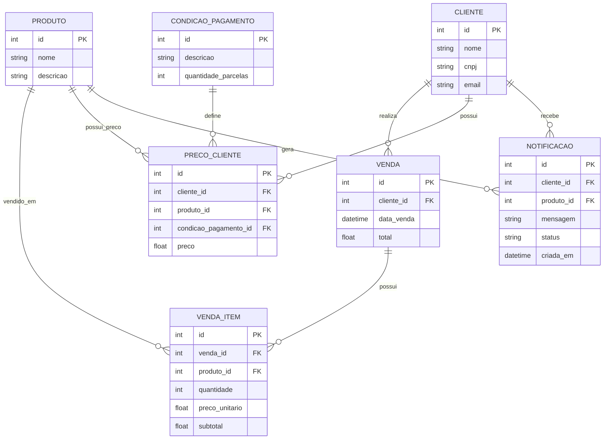

# Diagrama Entidade-Relacionamento Simplificado

## Explicação simples

- Um cliente pode fazer várias vendas.
- Uma venda possui um ou mais itens.
- Cada item da venda possui um produto e o preço pago naquele momento.
- A tabela `precos_cliente` guarda o preço praticado para cada cliente.
- Quando um novo preço fica menor que o preço já pago em uma venda, o sistema cria uma notificação.
